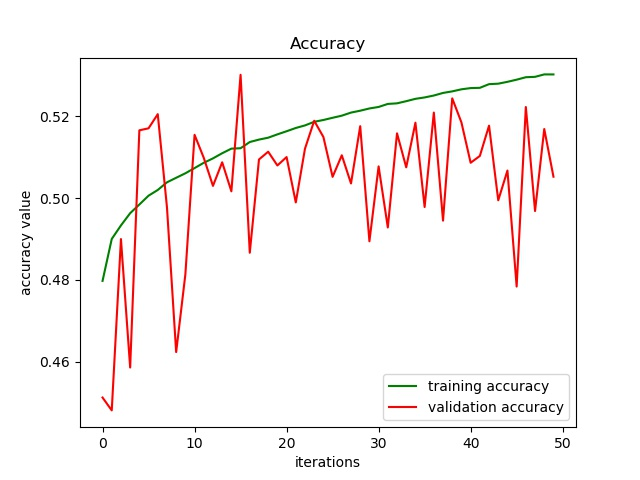

# Deep Neural Network
## Description
In order to further improve the prediction performance, we developed a deep learning algorithm to perform regression task on the save training data. As the figure below shows, the model is made up with two hidden layers and one output layer. As our initial design, both hidden layers have 128 nodes with sigmoid activate function. The output layer has only one node, which denotes the predicted granted days for the input patent. During the training, to optimize the performance, we set the learning rate to 0.0005 and batch size to 128. Besides, we use Mean Square Root Error as the loss function. To avoid overfitting and boost training speed, we adopt adam optimizer in our training stage. In term of data, the pre-processed data is divided into 3 parts: train, validation and test. The ratio for three parts are 0.56, 0.14 and 0.2. The model is trained with train set, and validated with validation set during training. The Final result is tested on the test set. 

##Result 
Two curves are plotted on the change of loss on both train set and validation set. Besides, in the experiment, we regulared that a prediction is a good prediction if the absolute error is within half year (180 days). The curves for prediction accuracy changes during training are also plotted. 

 

We found that with our experiment setting, the model will converge at around 10th epoch. Overfitting may occur with further training. Therefore, we take the model trained after 10th epoch for testing. In the test, we mainly evaluate three criterias: Mean Square Root Error, Absolute Error, and Accuracy. The result is shown below. Besides, we also plot curves of ground truth and prediction results of first 25 samples in test set. 

| Number Of Hidden Layers | Number of Nodes in Hidden Layers | Activation Function | RMSE | Absolute Error | Accuracy |
|--|--|--|--|--|--|
|2|128|Sigmoid|358.96|241.25|0.5119|

 
We also modified our hyper - parameters with more experiments. Overall, we made attempts on changing the model structure and use ReLU as activation function instead of sigmoid. All parameter sets and results are shown in the table below.

   
|Index| Number Of Hidden Layers | Number of Nodes in Hidden Layers | Activation Function | RMSE | Absolute Error | Accuracy |
|--|--|--|--|--|--|--|
|1|2|128|Sigmoid|358.96|241.25|0.5119|
|2|2|512|Sigmoid|358.14|241.13|0.5111|
|3|2|512|ReLU|362.54|249.89|0.4809|
|4|0|N/A|N/A|xx|xx|xx|
|5|1|128|Sigmoid|xx|xx|xx|

Overall, the best result achieved with DNN is from experiment x, which achieves the RMSE at xxx.

 

