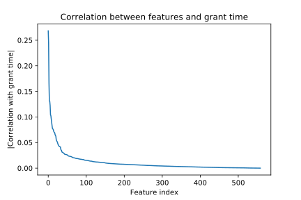
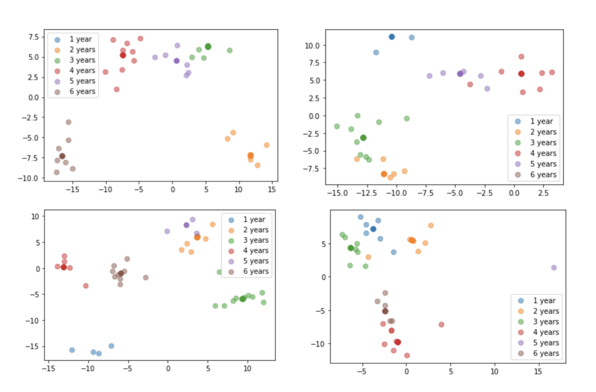
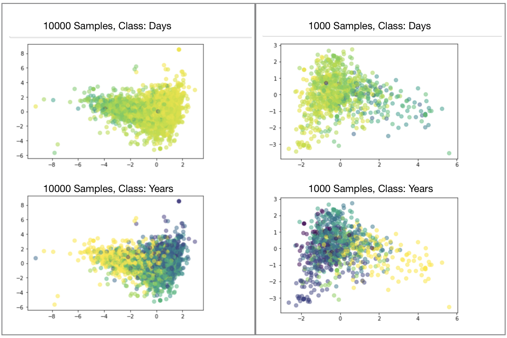
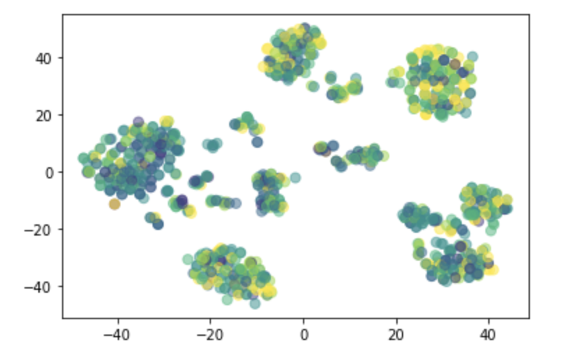
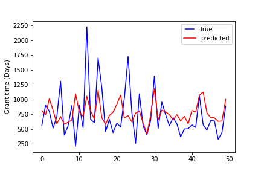
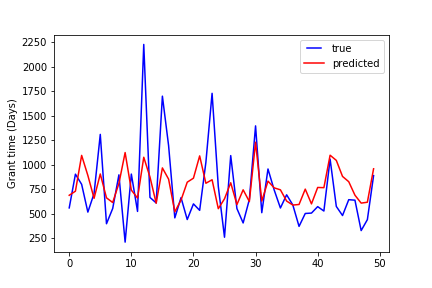
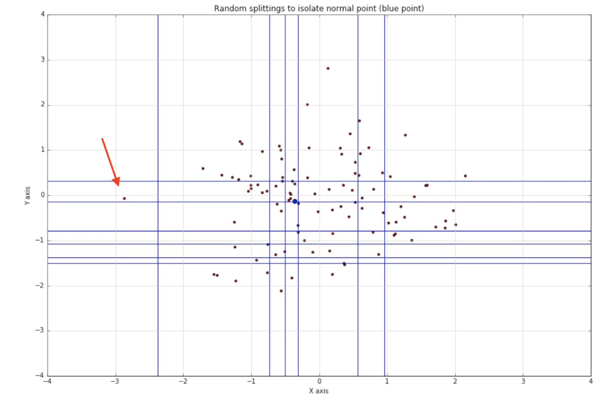
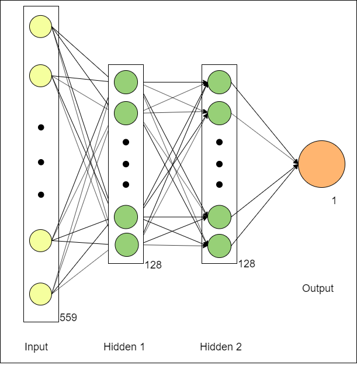
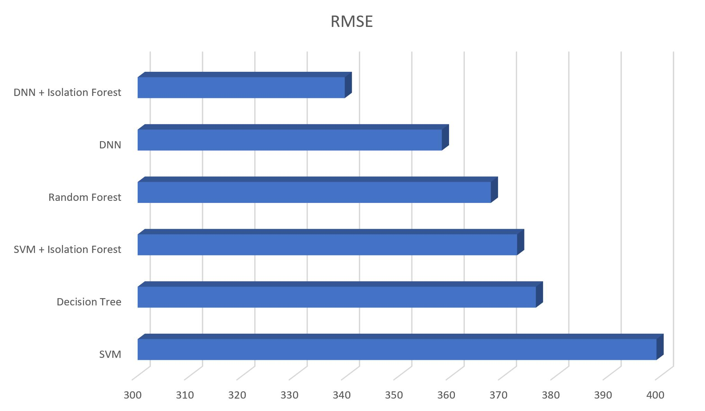

## Introduction

Analyzing intellectual property data using machine learning techniques is gaining popularity in recent years. Trends and relationships in patent databases are mined and applied to knowledge management, technology management, economic development estimation, as well as extraction and management of information [1].

Our objective is to build a model that will take in information of a patent (filing date, inventor’s country, team size, category, etc.) and predict the length of the time interval between filing and granting (grant time). Previous works [2][3] on patent analysis have used statistics and data science methods such as time series analysis, entity recognition, and relation extraction. We hope to analyze how grant time depends on various aspects of a patent, and then improve the prediction quality using deep neural networks.

This work will complement Dr. Ramachandran group's study on how grant delays affect inventors’ motivations [4]. It has been shown that patent grant delays is associated with decreasing future patenting activities. By predicting the grant time in advance, managers can have a better understanding of the productivity of the inventors in the future and adjust plans accordingly. The grant time prediction can also help companies in preparing for the next steps in developing the patented product. 

## Data Preparation

The data we use is from the United States Patent and Trademark Office (USPTO) and contains 1048575 patents filed over the past 50 years. The dataset contains 63 columns for each patent, including inventors, team size, country of inventor, category of patent, etc. 

Preprocessing:
* Remove redundant columns
  * Application year (we already have application date), etc.
* Remove features if majority of rows have empty value
* Transform various data types to processable number (int/float)
  * Applicaiton date, grant date, etc.
  * "1-Team" -> "1"
* Convert categorical features to one-hot representation
  * Class, subclass, etc.
* Normalize numerical features

After preprocessing, we obtained 559 features. Below is a plot that shows the absolute value of correlation between each feature and grant time. A few features are strongly correlated with the grant time, and most features are somewhat correlated. Examples of high correlations: TEAM (0.244), NBCITE (0.166), CATEGORY_Computers and Electronics (0.131), INVCOUNTRY_JP (0.122)

The input of our prediction models are the 559 pre-processed features. The variable we aim to predict is the grant time. Grant time is calculated as (approval date - application date), and has unit of both days (for regression) and years (for classification). 

## Linear Discriminant Analysis (LDA)

Firstly, we tried to test the correlation between the granting time and the features that we used. Since the Linear discriminant analysis (LDA) does quite well in finding the linear combination of features to model the difference between different classes, we applied the LDA to our data and made a 2D plot for the first two components of LDA.

We first tried LDA on 100 samples and repeated it several times. From the results, we can observe rough clusters, though some classes sometimes may overlap.

Then, we tried to apply LDA on larger subsets. We noticed that using years as classes may not be very ideal because 364 days and 366 days, for example, are very close to each other, but would be classified into different classes. Therefore, we tried to do experiments using both days as labels and years (1-6) as labels. 

The figures below are our results: The left two are results based on 10000 samples and the right two are based on 1000 samples. 

The upper figures uses granting days as labels. A lighter color indicates a shorter granting days and a darker color indicates a longer days.

The lower figures uses granting years (1,2,…,6 years) as labels and the darker color indicates the shorter years.

From the results, we can see that samples of shorter and longer granting time are separated after using LDA to some extent, though not that clearly. Especially for those samples in the middle, LDA did not bring an ideal classification. The reason may be that the correlation between features and grant time is not very strong, or that the relationship between them is more complicated (more than linearly) and therefore more sophisticated models are required to detect it.

Besides, we tried to test if a non-linear combination of features can explain the granting time. We applied TSNE on 1000 samples and made 2D plot of first two components. The result is still not ideal.

## Decision tree and Random forest
We used decision tree regression and random forest regression to analyze the dataset. To improve the performance of our model, the following parameters were tuned through Grid-search: max_depth, min_samples_leaf, max_features for decision tree and n_estimators, max_depth, min_samples_leaf, max_features for random forest. Mean square error was used to evaluate the parameters. 

According to Grid-search, the best parameters for decision tree is max_depth=10, max_features=1.0, min_samples_leaf=10.
The best parameters for is n_estimators = 300, max_depth = 30, min_samples_leaf = 5, and max_features = 0.2.

Random forest performed slightly better than decision tree:

- The root mean square error of decision tree regression is 376.11.
- The root mean square error of random forest regression is 367.50.

Compare the true grant time and the predicted grant time of the first fifty data points:

Decision tree:

Random forest:

## Isolation Forest
We use isolation forests to filter out outliers when training our model to improve accuracy. Isolation forest is an unsupervised learning algorithm that is used to differentiate outliers and inliers. It is based on the assumption that outliers tend to deviate from average and are less in terms of quantity. 

Each isolation tree works quite similar to a binary space partition tree. Every partition just adds a line to divided up space between two random data points until the desired partition count is met.  The outliers reside in the region that can be isolated with fewer lines. For example, the data point marked by the red arrow can be separate using only two horizontal lines and one vertical line. 

Thus, if we compare the result between error between inlier data and all the data. We could see some accuracy improvement. Here is the result comparison for SVM.

|Avg Error | Avg Error For Inlier data  | RMSE | RMSE for Inlier Data |
|--|--|--|--|
|255.49|232.08|399.16|372.52|

## Deep Neural Networks (DNN)

### Description
In order to further improve the prediction performance, we developed a deep learning algorithm to perform regression task on the save training data. As the figure below shows, the model is made up with two hidden layers and one output layer. As our initial design, both hidden layers have 128 nodes with sigmoid activate function. The output layer has only one node, which denotes the predicted granted days for the input patent. During the training, to optimize the performance, we set the learning rate to 0.0005 and batch size to 128. Besides, we use Mean Square Root Error as the loss function. To avoid overfitting and boost training speed, we adopt adam optimizer in our training stage. In term of data, the pre-processed data is divided into 3 parts: train, validation and test. The ratio for three parts are 0.56, 0.14 and 0.2. The model is trained with train set, and validated with validation set during training. The Final result is tested on the test set. 

###Result 
Two curves are plotted on the change of loss on both train set and validation set. Besides, in the experiment, we regulared that a prediction is a good prediction if the absolute error is within half year (180 days). The curves for prediction accuracy changes during training are also plotted. 

 

We found that with our experiment setting, the model will converge at around 10th epoch. Overfitting may occur with further training. Therefore, we take the model trained after 10th epoch for testing. In the test, we mainly evaluate three criterias: Mean Square Root Error, Absolute Error, and Accuracy. The result is shown below. Besides, we also plot curves of ground truth and prediction results of first 25 samples in test set. 

| Number Of Hidden Layers | Number of Nodes in Hidden Layers | Activation Function | RMSE | Absolute Error | Accuracy |
|--|--|--|--|--|--|
|2|128|Sigmoid|358.96|241.25|0.5119|

 
We also modified our hyper - parameters with more experiments. Overall, we made attempts on changing the model structure and use ReLU as activation function instead of sigmoid. All parameter sets and results are shown in the table below.

   
|Index| Number Of Hidden Layers | Number of Nodes in Hidden Layers | Activation Function | RMSE | Absolute Error | Accuracy |
|--|--|--|--|--|--|--|
|1|2|128|Sigmoid|358.96|241.25|0.5119|
|2|2|512|Sigmoid|358.14|241.13|0.5111|
|3|2|512|ReLU|362.54|249.89|0.4809|
|4|0(Linear Regression)|N/A|N/A|379.8|258.7|0.472|
|5|1|128|Sigmoid|358.94|244.2|0.4985|

Overall, the best result achieved with DNN is from experiment 2, which achieves the RMSE at 358.14.

### Result On Fine-Tuned Dataset
With Isolation Forest Algorithm, we remove some outlier samples in the train dataset. With the fine-tuned dataset, we trained a new deep model. The parameter setting and result are shown below: 

| Number Of Hidden Layers | Number of Nodes in Hidden Layers | Activation Function | RMSE | Absolute Error | Accuracy |
|--|--|--|--|--|--|
|2|128|Sigmoid|339.58|224.41|0.5437|

Obviously, removing outlier in training dataset have a great improvement on the result of deep neural network model in all three criterias. 

## Discussion

## Conclusion

## Reference
[1] Aristodemou, Leonidas, Frank Tietze, “The state-of-the-art on Intellectual Property Analytics (IPA): A literature review on artificial intelligence, machine learning and deep learning methods for analysing intellectual property (IP) data.” World Patent Information, 37-51, 55 (2018).

[2] C. Lee, J. Kim, O. Kwon, H.-G. Woo, “Stochastic technology life cycle analysis using multiple patent indicators, Technol. Forecast.” Soc. Change 53–64, 106 (2016).

[3] H.-W. Chun, J.-M. Lee, W. Yeo, S. Kim, H.-S. Yoon, I. Song, S.-W. Hong, B.-Y. Coh, “Detection of technology opportunities from patents.” Int. J. Appl. Eng. Res. 9, 21, 8731–8736 (2014).

[4] Chhabra, Param Pal singh, Manpreet Hora, Karthik Ramachandran, “Patent Grant Delays and Future Innovative Activities.” Academy of Management Proceedings 16192, 1 (2019).

