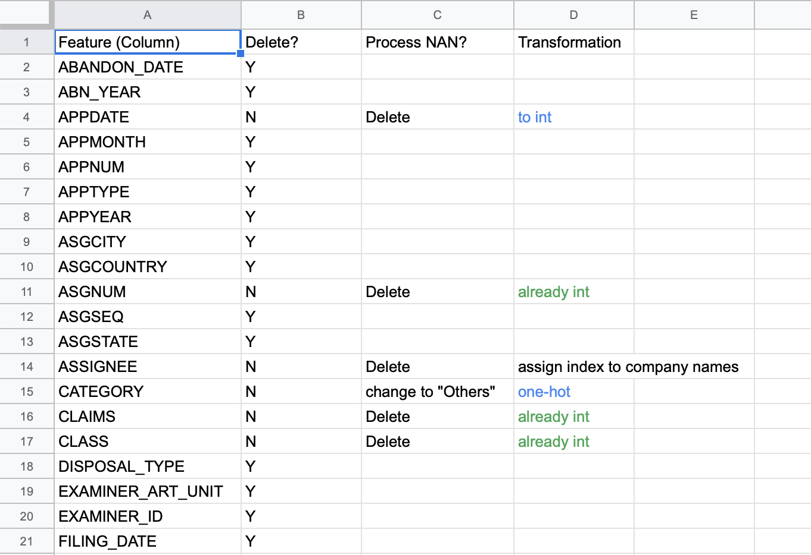
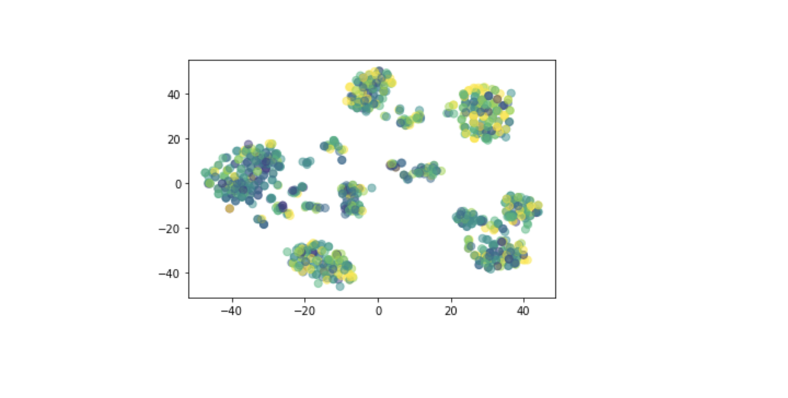

## Introduction

Analyzing intellectual property data using machine learning techniques is gaining popularity in recent years. Trends and relationships in patent databases are mined and applied to knowledge management, technology management, economic development estimation, as well as extraction and management of information [1].

Our objective is to build a model that will take in information of a patent (filing date, inventor’s country, team size, category, etc.) and predict the length of the time interval between filing and granting (grant time). Previous works [2][3] on patent analysis have used statistics and data science methods such as time series analysis, entity recognition, and relation extraction. We hope to analyze how grant time depends on various aspects of a patent, and then improve the prediction quality using deep neural networks.

This work will complement Dr. Ramachandran group's study on how grant delays affect inventors’ motivations [4]. It has been shown that patent grant delays is associated with decreasing future patenting activities. By predicting the grant time in advance, managers can have a better understanding of the productivity of the inventors in the future and adjust plans accordingly. The grant time prediction can also help companies in preparing for the next steps in developing the patented product. 

## Methods

### Data Preparation

The data we use is from the United States Patent and Trademark Office (USPTO) and contains 1048575 patents filed over the past 50 years. The dataset contains 63 features for each patent, including inventors, team size, country of inventor, category of patent, etc. 

Preprocessing:
* Remove redundant columns
  * Application year (we already have application date), etc.
* Remove features if majority of rows have empty value
* Transform various data types to processable number (int/float)
  * Applicaiton date, grant date, etc.
  * "1-Team" -> "1"
* Convert categorical features to one-hot representation
  * Class, subclass, etc.
* Normalize numerical features

Details about each feature are available upon request. As an example, the figure below shows the processing of the first 20 features.

The input of our prediction models are the pre-processed features. The variable we aim to predict is the grant time (approval date minus application date). We save the grant time in both days (for regression) and years (for classification). 

### Linear Discriminant Analysis (LDA)

### Deep Neural Networks (DNN)

### Isolation Forest

## Result

### LDA Analysis

Firstly, we tried to test the correlation between the granting time and the features that we used. Since the Linear discriminant analysis (LDA) does quite well in finding the linear combination of features to model the difference between different classes, we applied the LDA to our data and made a 2D plot for the first two components of LDA.

We first tried LDA on 100 samples and repeated it several times. From the results, we can observe rough clusters, though some classes sometimes may overlap.

Then, we tried to apply LDA on larger subsets. We noticed that using years as classes may not be very ideal because 364 days and 366 days, for example, are very close to each other, but would be classified into different classes. Therefore, we tried to do experiments using both days as labels and years (1-6) as labels. 

The figures below are our results: The left two are results based on 10000 samples and the right two are based on 1000 samples. 

The upper figures uses granting days as labels. A lighter color indicates a shorter granting days and a darker color indicates a longer days.

The lower figures uses granting years (1,2,…,6 years) as labels and the darker color indicates the shorter years.

From the results, we can see that samples of shorter and longer granting time are separated after using LDA to some extent, though not that clearly. Especially for those samples in the middle, LDA did not bring an ideal classification. The reason may be that the correlation between features and grant time is not very strong, or that the relationship between them is more complicated (more than linearly) and therefore more sophisticated models are required to detect it.

Besides, we tried to test if a non-linear combination of features can explain the granting time. We applied TSNE on 1000 samples and made 2D plot of first two components. The result is still not ideal.

## Discussion

## Conclusion

## Reference
[1] Aristodemou, Leonidas, Frank Tietze, “The state-of-the-art on Intellectual Property Analytics (IPA): A literature review on artificial intelligence, machine learning and deep learning methods for analysing intellectual property (IP) data.” World Patent Information, 37-51, 55 (2018).

[2] C. Lee, J. Kim, O. Kwon, H.-G. Woo, “Stochastic technology life cycle analysis using multiple patent indicators, Technol. Forecast.” Soc. Change 53–64, 106 (2016).

[3] H.-W. Chun, J.-M. Lee, W. Yeo, S. Kim, H.-S. Yoon, I. Song, S.-W. Hong, B.-Y. Coh, “Detection of technology opportunities from patents.” Int. J. Appl. Eng. Res. 9, 21, 8731–8736 (2014).

[4] Chhabra, Param Pal singh, Manpreet Hora, Karthik Ramachandran, “Patent Grant Delays and Future Innovative Activities.” Academy of Management Proceedings 16192, 1 (2019).

